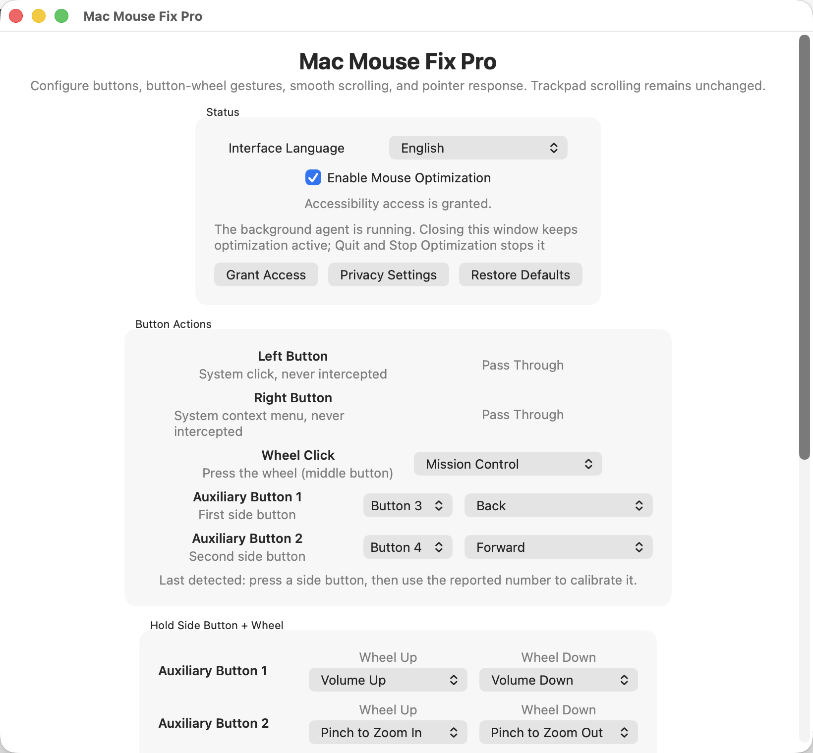

<p align="center">
  
</p>

<h1 align="center">Mac Mouse Fix Pro</h1>

<p align="center">
  A native macOS utility that brings smooth scrolling, reliable side-button remapping,
  and trackpad-style gestures to third-party mice.
</p>

<p align="center">
  
  
  
  
</p>

<p align="center">
  <a href="https://github.com/yf-official/MacMouseFixPro/releases/latest"><strong>Download for macOS</strong></a>
  ·
  <a href="#简体中文">简体中文</a>
  ·
  <a href="https://github.com/yf-official/MacMouseFixPro/issues">Report an issue</a>
</p>

<p align="center">
  
</p>

## Why Mac Mouse Fix Pro?

Many third-party mice only receive basic support on macOS. Mechanical wheel input can feel abrupt, side-button numbering varies between devices, and useful trackpad gestures are unavailable. Mac Mouse Fix Pro improves those interactions while leaving native trackpad scrolling untouched.

## Features

| Feature | What it does |
| --- | --- |
| Trackpad-like smooth scrolling | Converts wheel notches into continuous pixel scrolling with adjustable momentum |
| Side-button remapping | Assigns system and app actions to the wheel click and two auxiliary buttons |
| Button calibration | Supports mice that report their side buttons as 3/4, 4/5, or other identifiers |
| Hold side button + wheel | Maps wheel-up and wheel-down gestures independently for each auxiliary button |
| Native pinch zoom | Sends a complete macOS magnification gesture instead of a keyboard zoom shortcut |
| Pointer tuning | Adjusts pointer speed and optional low-pass smoothing for mechanical mice |
| English and Chinese UI | Switches the settings window, menu bar, Dock menu, actions, and status messages instantly |
| Background operation | Keeps your settings active after the window is closed and stops cleanly when you quit |

## Default Controls

| Input | Default action |
| --- | --- |
| Wheel click | Mission Control |
| Auxiliary Button 1 | Back |
| Auxiliary Button 2 | Forward |
| Hold Auxiliary Button 1 + wheel | Volume up / down |
| Hold Auxiliary Button 2 + wheel | Trackpad-style pinch zoom in / out |

Actions also include Show Desktop, Launchpad, Space switching, app switching, tab controls, clipboard actions, undo/redo, screenshots, screen locking, and media volume.

## Install

1. Download `MacMouseFixPro.zip` from the [latest release](https://github.com/yf-official/MacMouseFixPro/releases/latest).
2. Extract the archive and move `MacMouseFixPro.app` to Applications.
3. Open the app and grant Accessibility access when macOS asks for it.
4. Choose English or Simplified Chinese under **Status > Interface Language**.
5. Configure your buttons, scrolling, and pointer response.

Closing the settings window keeps optimization running. Use **Quit and Stop Optimization** from the menu bar when you want to stop it completely.

> Current release builds are not notarized with an Apple Developer ID. On first launch, you may need to Control-click the app in Finder and choose **Open**. Download runnable builds from Releases, not from the source-code archive.

## Side-Button Calibration

1. Press a side button while the settings window is open.
2. Read the identifier shown under **Last detected**.
3. Assign that identifier to Auxiliary Button 1 or Auxiliary Button 2.
4. Choose the click action and the wheel-up / wheel-down actions.

The two auxiliary buttons cannot share one identifier. Selecting an identifier already in use swaps the mappings automatically.

## Privacy

Mac Mouse Fix Pro runs locally. It does not require an account, collect telemetry, or send mouse input over the network. Accessibility permission is required because macOS only allows trusted apps to monitor and transform global mouse events.

<details>
<summary><strong>Build from source</strong></summary>

Requires macOS 13 or later and Xcode Command Line Tools.

```sh
git clone https://github.com/yf-official/MacMouseFixPro.git
cd MacMouseFixPro
swift test
scripts/build_app.sh
```

Build output is written to `dist/MacMouseFixPro.app` and `dist/MacMouseFixPro.zip`.

</details>

## Acknowledgements

The product direction and parts of the interaction design were inspired by [Mac Mouse Fix](https://github.com/noah-nuebling/mac-mouse-fix). Mac Mouse Fix Pro is an independent open-source project and is not affiliated with Apple or the original Mac Mouse Fix project.

<details id="简体中文">
<summary><strong>简体中文介绍</strong></summary>

## 项目简介

Mac Mouse Fix Pro 是一款面向第三方鼠标的原生 macOS 优化工具，让机械滚轮获得连续、带惯性的滚动效果，并提供可靠的侧键映射和接近触控板的组合手势。原生触控板滚动保持系统行为，不会被软件接管。

## 主要功能

| 功能 | 说明 |
| --- | --- |
| 触控板式丝滑滚动 | 将机械滚轮输入转换为连续像素滚动，并提供可调节的短暂惯性 |
| 侧键重映射 | 配置中键、辅助按键 1 和辅助按键 2 的系统或应用操作 |
| 侧键编号校准 | 兼容侧键上报为 3/4、4/5 或其他编号的第三方鼠标 |
| 按住侧键 + 滚轮 | 为两个辅助按键分别设置滚轮向上和向下动作 |
| 原生捏合缩放 | 发送完整的 macOS magnification 手势，模拟触控板双指捏合 |
| 指针手感调整 | 调整指针速度，并可启用低通平滑以减轻机械鼠标的细小抖动 |
| 中英文界面 | 设置窗口、菜单栏、Dock 菜单、动作名称和状态提示均可即时切换 |
| 后台运行 | 关闭窗口后继续应用设置，完全退出时会停止输入优化 |

## 默认操作

| 输入 | 默认动作 |
| --- | --- |
| 滚轮按下 | 调度中心 |
| 辅助按键 1 | 后退 |
| 辅助按键 2 | 前进 |
| 按住辅助按键 1 + 滚轮 | 增大 / 减小音量 |
| 按住辅助按键 2 + 滚轮 | 触控板式捏合放大 / 缩小 |

## 安装

1. 从 [最新版本](https://github.com/yf-official/MacMouseFixPro/releases/latest) 下载 `MacMouseFixPro.zip`。
2. 解压后将 `MacMouseFixPro.app` 移动到“应用程序”文件夹。
3. 打开 App，并根据 macOS 提示授予辅助功能权限。
4. 在“运行状态 > 界面语言”中选择简体中文或 English。
5. 根据鼠标实际情况配置侧键、滚轮和指针手感。

关闭设置窗口后优化会继续运行。如需完全停止，请从菜单栏选择“退出并停止优化”。当前版本尚未经过 Apple Developer ID 公证，首次打开时可能需要在 Finder 中按住 Control 点按 App，然后选择“打开”。

## 隐私

Mac Mouse Fix Pro 完全在本机运行，不要求登录、不收集遥测信息，也不会通过网络发送鼠标输入。辅助功能权限仅用于监听和转换全局鼠标事件。

</details>
