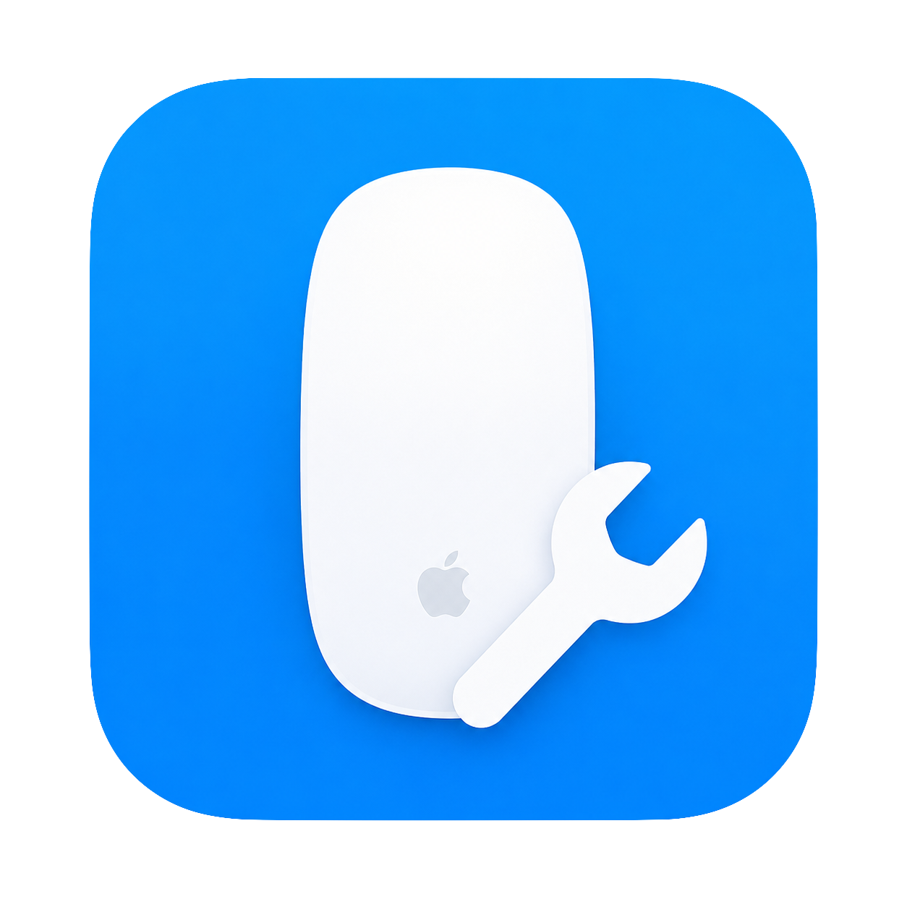

<p align="center">
  
</p>

<h1 align="center">Mac Mouse Fix Pro</h1>

<p align="center">
  一款面向第三方鼠标的原生 macOS 优化工具。让普通鼠标拥有更丝滑的滚动、可配置的侧键，以及接近触控板的组合手势体验。
</p>

<p align="center">
  
  
  
  
</p>

<p align="center">
  <a href="https://github.com/yf-official/MacMouseFixPro/releases/latest"><strong>下载最新版本</strong></a>
  ·
  <a href="https://github.com/yf-official/MacMouseFixPro/issues">反馈问题</a>
</p>

## 项目简介

macOS 对许多非 Apple 鼠标只提供基础支持：机械滚轮滚动生硬、侧键行为不统一，部分鼠标的按键编号也与常见定义不同。Mac Mouse Fix Pro 通过原生 Core Graphics 事件处理改善这些问题，同时保持触控板输入不受影响。

项目采用 Swift 编写，提供中文设置界面、菜单栏后台代理和 Dock 菜单。设置窗口关闭后优化仍会继续运行；从菜单栏退出时，代理会停止并恢复系统默认输入。

> Mac Mouse Fix Pro 是独立的第三方开源项目，不是 Apple 官方产品，也不隶属于原版 Mac Mouse Fix。

## 核心功能

| 功能 | 说明 |
| --- | --- |
| 触控板式丝滑滚动 | 将机械滚轮输入转换为连续像素滚动，并提供短暂动量衰减 |
| 侧键重映射 | 配置中键、辅助按键 1 和辅助按键 2，支持多种系统与应用操作 |
| 侧键编号校准 | 兼容侧键上报为 3/4、4/5 或其他编号的第三方鼠标 |
| 按住侧键 + 滚轮 | 分别配置滚轮向上和向下动作，触发组合后自动抑制侧键单击 |
| 原生捏合缩放 | 发送完整 magnification 手势，模拟触控板双指捏合，而不是键盘缩放快捷键 |
| 指针手感调整 | 可选的移动速度、低通平滑和快速移动响应保护 |
| 中文原生界面 | 设置窗口、菜单栏状态和运行提示均为中文 |
| 安全退出 | App、事件监听和后台代理绑定生命周期，退出后不会遗留输入拦截 |

## 默认操作

- 中键：调度中心
- 辅助按键 1：后退
- 辅助按键 2：前进
- 按住辅助按键 1 并滚动：增大 / 减小音量
- 按住辅助按键 2 并滚动：触控板捏合放大 / 缩小

还可配置显示桌面、启动台、切换空间、切换 App、标签页操作、复制粘贴、撤销重做、截图、锁屏和媒体音量等动作。

## 安装使用

1. 从 [Releases](https://github.com/yf-official/MacMouseFixPro/releases/latest) 下载 `MacMouseFixPro.zip`。
2. 解压并打开 `MacMouseFixPro.app`。
3. 按提示前往 `系统设置 > 隐私与安全性 > 辅助功能` 完成授权。
4. 返回 App，根据鼠标实际情况配置侧键和滚轮手感。
5. 设置完成后可以关闭窗口，菜单栏中的 `MMF` 会继续运行。
6. 如需完全停止优化，从菜单栏选择“退出并停止优化”。

> 未经 Apple 公证的本地构建首次打开时，可能需要在 Finder 中右键 App 并选择“打开”。

## 侧键校准

1. 在设置页按一下鼠标侧键。
2. 查看“最近检测”显示的底层按键编号。
3. 为“辅助按键 1”或“辅助按键 2”选择对应编号。
4. 选择单击动作，以及按住侧键滚动时的向上、向下动作。

两个辅助按键不能使用相同编号。选择已占用的编号时，App 会自动交换映射。

## 工作方式

- 主程序负责设置界面、权限检查和代理生命周期。
- 后台代理使用 Core Graphics event tap 监听鼠标输入。
- 机械滚轮事件由丝滑滚动控制器转换；触控板连续事件保持系统原样。
- 侧键组合由独立状态机管理，确保按下、组合触发和松开顺序完整。
- 捏合缩放包含 `Began → Changed → Ended` 生命周期，防止手势状态残留。

## 从源码构建

需要 macOS 13 或更高版本，以及 Xcode Command Line Tools。

```sh
git clone https://github.com/yf-official/MacMouseFixPro.git
cd MacMouseFixPro
swift test
scripts/build_app.sh
```

构建结果位于：

```text
dist/MacMouseFixPro.app
dist/MacMouseFixPro.zip
```

## 当前限制

- 尚未使用 Apple Developer ID 签名和公证。
- 暂不支持登录时自动启动、按 App 独立配置或按鼠标设备保存配置。
- 指针平滑属于软件级事件修正，不是硬件级重采样；不需要时建议关闭。
- 捏合缩放只对原本支持触控板捏合的应用生效。

## 致谢

本项目的鼠标增强方向和部分交互设计参考了 [Mac Mouse Fix](https://github.com/noah-nuebling/mac-mouse-fix)。实现代码由本项目独立维护。
